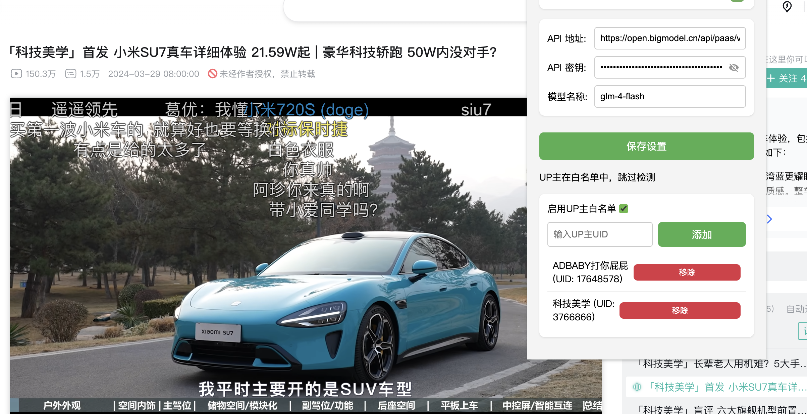

# 添加UP主白名单功能

## PR 概述
该PR实现了UP主白名单功能，允许用户将特定UP主加入白名单，在播放这些UP主的视频时跳过广告检测，从而解决部分UP主视频内容被误判为广告的问题。

## 功能特性
- ✨ 新增UP主白名单管理界面
- 🎛️ 提供白名单功能总开关
- 📝 支持通过UID添加UP主到白名单
- 🗑️ 支持从白名单中移除UP主
- 🔍 在广告检测前自动检查UP主白名单状态

## 界面预览

> 待添加：请在此处添加插件设置界面的截图，展示白名单管理功能的UI

## 技术实现
### 新增文件
- `/src/types/whitelist.ts`: 白名单相关类型定义
- `/src/services/whitelist.ts`: 白名单管理服务实现

### 修改文件
- `/src/popup.ts`: 添加白名单管理UI和相关功能
- `/src/content.ts`: 集成白名单检查逻辑
- `/src/services/bilibili.ts`: 新增获取UP主信息接口

### 存储方案
- 使用Chrome Storage API存储白名单配置
- 键名：`up_whitelist_config`
- 配置结构包含功能开关和UP主列表

## 测试项目
- [x] 白名单功能开关正常工作
- [x] 成功添加UP主到白名单
- [x] 成功从白名单移除UP主
- [x] 白名单中的UP主视频正确跳过广告检测
- [x] 配置正确保存并在重启后恢复
- [x] 界面操作响应及时，提供清晰的反馈

## 使用说明
1. 在插件设置界面找到"UP主白名单"区域
2. 启用白名单功能开关
3. 在输入框中输入UP主UID
4. 点击"添加"按钮将UP主加入白名单
5. 可以通过列表中的"移除"按钮删除不需要的白名单UP主

## 后续计划
- [ ] 支持批量导入/导出白名单
- [ ] 添加UP主搜索功能
- [ ] 支持白名单分组管理
- [ ] 添加白名单有效期设置

## 相关Issue
Closes #UP_WHITELIST

## 备注
该功能为v1.0版本的基础实现，后续版本将根据用户反馈继续优化和增加新特性。